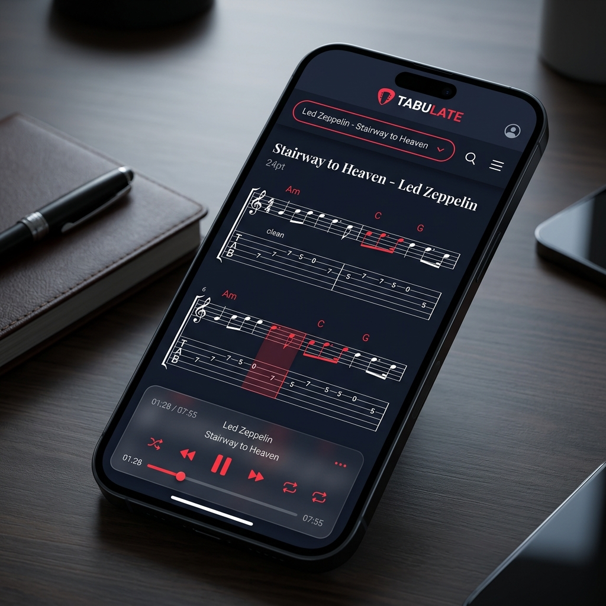

# Tabulate - Elite Guitar Tab PWA Design Demo

## 1. 設計願景 (Design Vision)
本設計旨在為專業吉他手提供一個高感官、低干擾的練習環境。透過深色模式與極簡的懸浮 UI，讓使用者的注意力完全集中在樂譜與節奏上。

## 2. 核心元素分析 (Core Elements)

### 視覺風格 (Visual Style)
- **色調**：使用深邃的海軍藍背景 (#0A0C14) 搭配衝擊力強的鮮紅色 (#FF4D4D)。
- **材質**：大量運用磨砂玻璃效果 (Glassmorphism)，特別是在底部控制中心，營造出層次感與現代感。
- **字體**：標題使用 Serif 有襯線字體增添史詩感；功能文字使用 Sans-serif 無襯線字體確保清晰度。

### 介面功能 (Interface Features)
- **Pill-Shaped Header**：整合了品牌 Logo、曲目搜尋與進階選單。
- **Dynamic Notation**：支援反轉色樂譜呈現，並具備實時小節高亮與和弦提示。
- **Floating Console**：懸浮式的音訊引擎控制器，包含完整的播放控制、即時進度條與曲目元數據展示。

## 3. 佈局結構 (Layout Architecture)

| 區域 | 組件 | 佈局技術 | 說明 |
| :--- | :--- | :--- | :--- |
| **頂部** | 導航與選單 | Flexbox (Justify-Between) | 膠囊式設計，整合 LOGO 與全域功能。 |
| **中部** | 樂譜內容區 | Block (Auto-Height) | 核心展示區，支援自動排版與水平橫移。 |
| **底部** | 浮動播放器 | Fixed (Inset-0) / Backdrop-Blur | 懸浮層設計，不影響樂譜閱讀的同時提供即時操控。 |

## 4. 未來優化方向 (Next Steps)
- **Responsive Animations**：加入平滑的過渡動畫，例如當旋律跳轉時樂譜的平滑捲動。
- **Haptic Feedback**：在支援的設備上，當樂譜高亮切換時提供輕微的震動反饋。
- **OLED Optimization**：確保在極端光線環境下仍具備極佳的可閱讀性。
